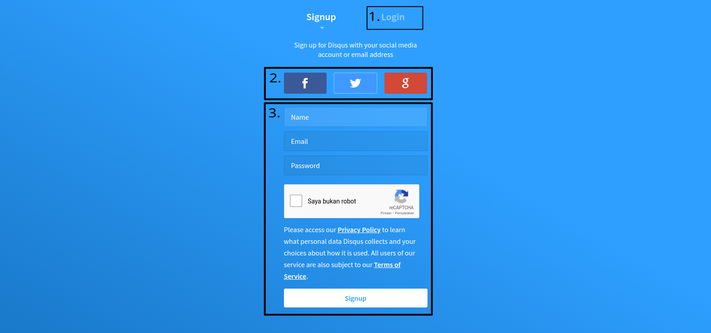
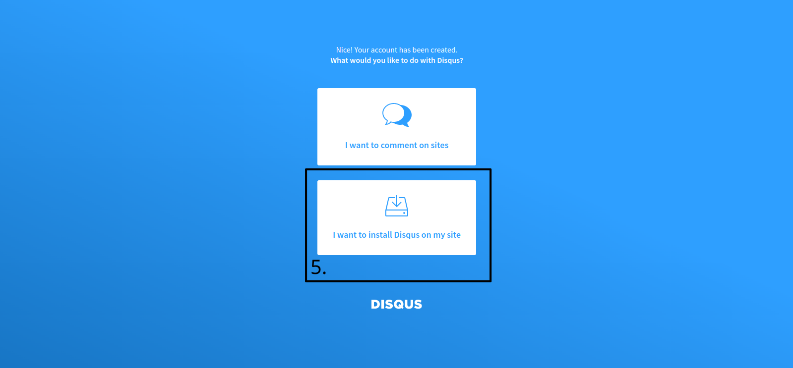
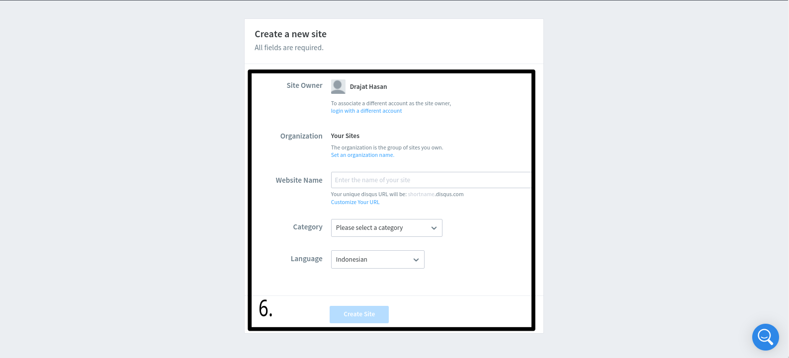
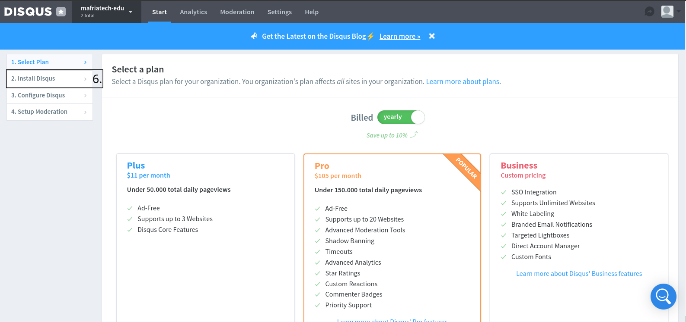
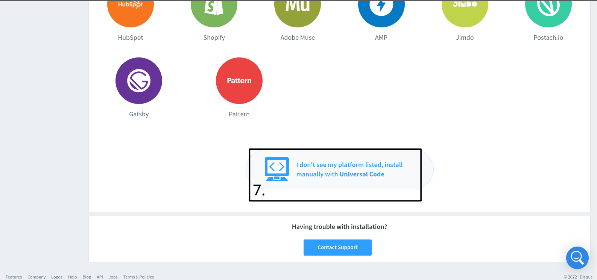
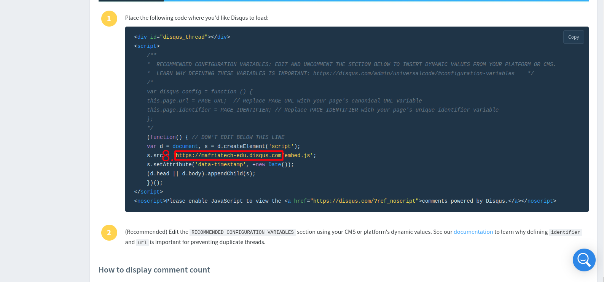
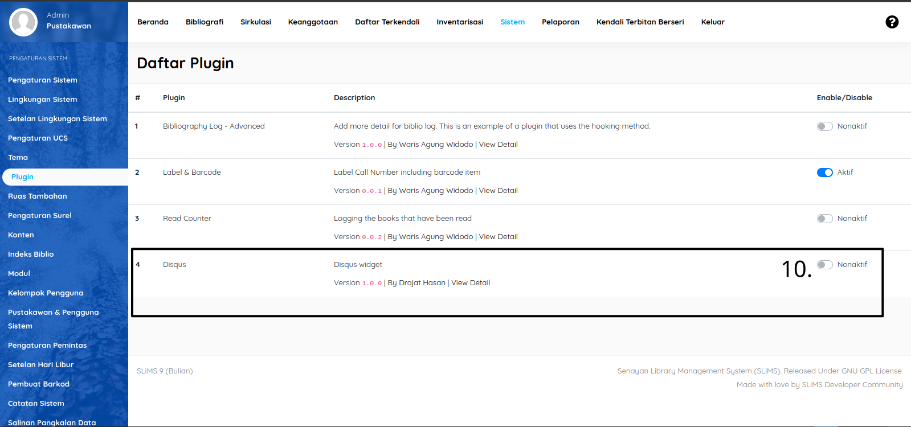
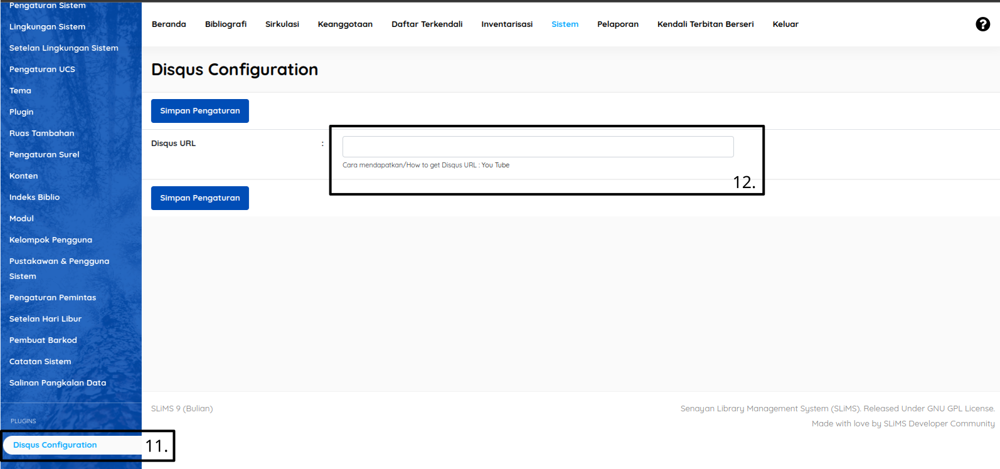
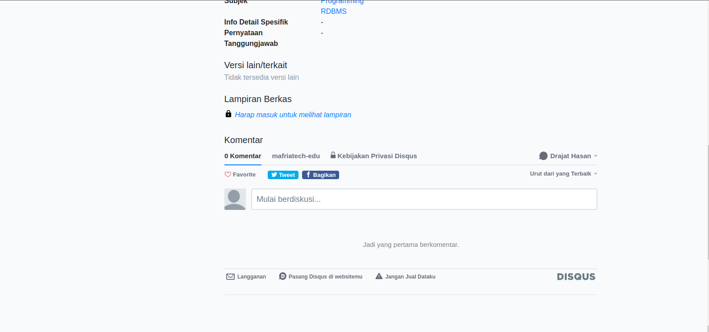

# Apresiasi
Terimakasih [buitenzorg812](https://github.com/buitenzorg812) untuk ide inti dari plugin ini.

# Cara/How to install

Masuk ke laman https://disqus.com/, klik yang saya lingkari

## Langkah-langkah pemasangan
1. Akun Disqus

1.1. Login jika anda sudah memiliki akun
1.2. Login menggunakan akun medsos anda
1.3. Mendaftar akun baru

2. Setelah berhasil login 
2.5 pilih "*I want to install Disqus on my site*"

3. Melengkapi detail laman.
3.6 Tulis nama yang akan menjadi web "Disqus" anda pada isian "Website Name", contoh : mafria-tech (tanpa .com dll, karena nama yang anda tulis akan menjadi subdomain dari disqus.com)

setelah itu klik tombol "*Create Site*"
4. Mengambil url Disqus
4.7 Pilih menu "*Install Disqus*"

4.8 Gulir/*Scroll* kebawah lalu pilih menu "*I don't see my platform listed....*"

4.9 Salin dan Template (*Copy and Paste*) "*url*" yang saya tandai merah (Nanti dihalaman anda *url* itu akan berisi sesuai dengan apa yang anda isi pada poin 3.6)

5. Menginstall plugin disqus
Setalah anda mengunduh plugin ini, ekstrak file plugin ini yang berformat .zip pada folder plugins/ yang ada di folder utama SLiMS anda.
Selanjutnya masuk login sebagai *Super Admin* / Akun *admin* SLiMS anda, masuk ke module Sistem/*System* lalu pilih menu plugins. Aktifkan plugin tersebut, tekan tombol F5 atau *refresh* halaman tersebut.

6. Menempel/Paste Url
Pada point 4.9 anda sudah menyalin *url* website Disqus anda. Setelah itu
6.11 Masuk ke menu *Disqus Configuration* pada modul Sistem dibagian bawah.

6.12 Tempel/*Paste* kan *url* yang sudah diambil tadi. Setelah itu klik "Simpan Pengaturan"
7. Selesai
Plugin akan muncul pada halaman detail dari biblio anda pada OPAC

Semoga bermanfaat 😊
